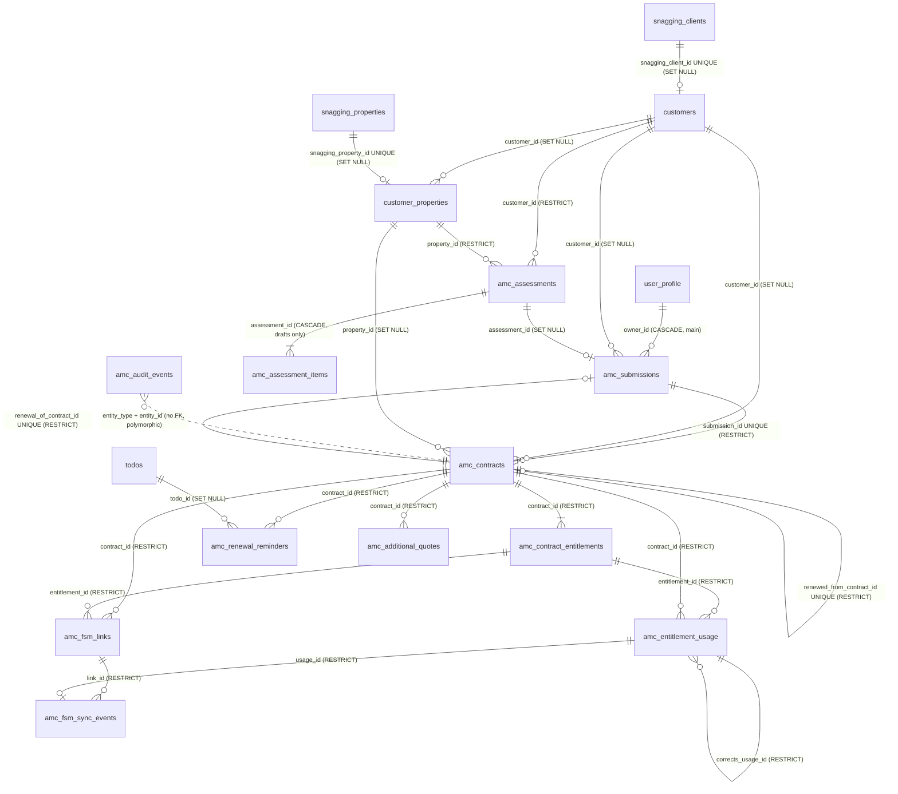

# AMC database architecture

**Date:** 6 October 2026. **Branch:** `amc-hardening`. **Scope:** every database object the AMC module uses: the 3 tables live in production (from `main`) and the 14 added on this branch, none of which is applied anywhere yet.
**Companion:** [`amc-migration-safety-report.md`](amc-migration-safety-report.md) covers whether and how the migrations can go to production.

**Evidence used:**
- `origin/main`'s migration files and application queries, read with `git show` (main was never checked out).
- The read-only production facts recorded on 5–6 Oct 2026. A fresh read-only check on 6 Oct failed with a connector authorisation error, so nothing newer was read.
- A local PostgreSQL 15 harness:
  - every migration applied twice;
  - 8 behavioural check suites;
  - a main-compatibility replay;
  - about 10k synthetic contracts with `EXPLAIN ANALYZE`;
  - 7 two-session race tests.

Nothing was run against production.

## 1. Final table inventory

**Before this branch:** 3 AMC tables, all in production. **After:** 17 (14 new, 0 merged, 0 removed).

| # | Table | Origin | Rows today (prod) | Kind |
|---|---|---|---|---|
| 1 | `amc_submissions` | main (live) | 28 | Proposal workflow (mutable until signed) |
| 2 | `amc_settings` | main (live) | 1 | Settings overrides document (single row) |
| 3 | `amc_audit_events` | main (live) | some | Append-only audit log, shared by every AMC entity |
| 4 | `amc_contracts` | `20261006100000` | 0 | Operational contract, frozen at activation |
| 5 | `amc_contract_entitlements` | `20261006100000` | 0 | One row per contracted service: type, allowance, used |
| 6 | `amc_entitlement_usage` | `20261006100000` | 0 | Append-only usage ledger |
| 7 | `amc_renewal_reminders` | `20261006110000` | 0 | One reminder per contract and threshold (dedupe) |
| 8 | `amc_fsm_service_mappings` | `20261006120000` | 0 | AMC service id → Zoho FSM service id |
| 9 | `amc_fsm_links` | `20261006120000` | 0 | FSM work order / appointment → contract entitlement |
| 10 | `amc_fsm_sync_events` | `20261006120000` | 0 | One row per FSM appointment and action (retry log) |
| 11 | `customers` | `20261006130000` | 0 | Shared customer master (not AMC-prefixed on purpose) |
| 12 | `customer_properties` | `20261006130000` | 0 | Shared property master |
| 13 | `amc_assessment_checklist` | `20261006130000` | 12 seeded | Editable assessment checklist |
| 14 | `amc_assessments` | `20261006130000` | 0 | Property assessment header |
| 15 | `amc_assessment_items` | `20261006130000` | 0 | Checklist answers, labels copied in |
| 16 | `amc_additional_service_discount` | `20261006130000` | 1 (off) | Discount configuration (single row) |
| 17 | `amc_additional_quotes` | `20261006130000` | 0 | Additional-service quote with frozen calculation |

**Also touched:**
- `todos`: the related-type CHECK is widened to allow `amc_contract`.
- `user_profile`: referenced as the actor on many tables.
- `snagging_clients` / `snagging_properties`: optional links from customers and properties.

**New functions:**
- `amc_apply_entitlement_usage`: the ledger trigger.
- `amc_entitlement_usage_append_only`.
- `amc_fsm_links_check`.
- `amc_assessment_items_locked`, `amc_assessments_locked`.
- `amc_additional_quotes_frozen`.
- `amc_next_assessment_number`, `amc_next_additional_quote_number`.
- `amc_activate_contract`.
- `amc_contracts_dashboard`.

**New sequences:** `amc_assessment_number_seq`, `amc_additional_quote_number_seq`.

## 2. Purpose of each table

- **`amc_contracts`:** what was signed and is now being delivered. It records who, where, when and for how much, copied from the signed proposal at activation. Only `status` (active → cancelled), the live customer/property/FSM links and `updated_at` change later.
- **`amc_contract_entitlements`:** the services of one contract.
  - Each has a type: `visits`, `hours`, `unlimited` or `informational`.
  - `included_quantity` and `used_quantity` record the allowance and how much of it is used.
  - Prices are copied in.
- **`amc_entitlement_usage`:** every consumption, adjustment and correction, never edited. `used_quantity` is this ledger's running sum.
- **`amc_renewal_reminders`:** which reminder Todo was made for which contract and threshold, so it is never made twice.
- **`amc_fsm_service_mappings`:** the translation from the AMC catalogue to FSM Services, kept by approvers.
- **`amc_fsm_links`:** staff's decision that an FSM work order (or one appointment of it) belongs to a contract entitlement. It keeps the coverage answer given at the time.
- **`amc_fsm_sync_events`:** the machine's record of checking an FSM appointment: outcome, reason, attempts and FSM's last view.
- **`customers`, `customer_properties`:** who the customer and property are today, shared across modules.
- **`amc_assessment_checklist`, `amc_assessments`, `amc_assessment_items`:** free property assessments that can start a proposal.
- **`amc_additional_service_discount`:** whether, how much and for what extra work is discounted. It is off.
- **`amc_additional_quotes`:** a computed price for extra work, frozen, optionally linked to an FSM estimate.

## 3. ER diagram



`amc_settings`, `amc_fsm_service_mappings`, `amc_assessment_checklist` and `amc_additional_service_discount` are configuration with no FK to the rest.

## 4. Why each table exists (necessity review)

| Table | Verdict | Why it cannot be folded into another |
|---|---|---|
| `amc_contracts` | **KEEP** | Different lifecycle from the proposal. It is frozen at activation, while the proposal stays a mutable, live workflow row in main. Allowing 1 proposal → 0..1 contract needs UNIQUE `submission_id` |
| `amc_contract_entitlements` | **KEEP** | Per-service state with row-level CHECKs (no over-use, informational never used). The ledger trigger locks one row per service |
| `amc_entitlement_usage` | **KEEP** | Append-only history. The idempotency key (`entitlement, external_type, external_reference`) and the corrections chain need rows |
| `amc_renewal_reminders` | **KEEP** | Dedupe key `(contract_id, threshold_days)`. It cannot live on the shared `todos` table without adding AMC columns there |
| `amc_fsm_service_mappings` | **KEEP** | Needs "one active AMC service per FSM service" (a partial unique index), which a JSON document cannot enforce |
| `amc_fsm_links` | **KEEP** | A staff decision with its own unique rules (one live link per appointment; per whole work order) and unlink history |
| `amc_fsm_sync_events` | **KEEP** | A machine log keyed by `(appointment, action)`, written on every check. It has a different key and churn from links |
| `customers` | **KEEP, NEEDS DISCUSSION** (ownership) | Shared master the business asked for. Which module owns it is a business decision (master report §7 A6) |
| `customer_properties` | **KEEP, NEEDS DISCUSSION** (ownership) | As above |
| `amc_assessment_checklist` | **KEEP** | Editable list with stable keys. Items copy its labels, so edits never rewrite history |
| `amc_assessments` | **KEEP** | Its own numbering, status and a lock once completed |
| `amc_assessment_items` | **KEEP** | Per-item answers, updated one at a time, locked by trigger once the assessment is completed (see §5, row 7) |
| `amc_additional_service_discount` | **KEEP** | See §5, row 5: `amc_settings` is written as one whole document by main's settings page |
| `amc_additional_quotes` | **KEEP** | Frozen calculation (trigger) plus FSM estimate link and its uniqueness |

**Result:** no table met the bar for REMOVE, MERGE or REPLACE. The goal was not the fewest tables but no needless ones. Each table here carries a constraint, key or lifecycle that would be lost in a merge.

## 5. Tables considered for merging

| # | Table A | Table B | Merge? | Why | Benefit if merged | Risk if merged | Migration / code impact |
|---|---|---|---|---|---|---|---|
| 1 | `amc_submissions` | `amc_contracts` | **NO** | A proposal is a mutable, live workflow row owned by main. A contract is frozen. 1 : 0..1 | One table | Main's live table would gain ~30 contract columns and every main query would see them. Contract immutability could only be enforced with triggers on main's table. High coupling to production | Large; touches main's live table |
| 2 | `amc_contract_entitlements` | `amc_entitlement_usage` | **NO** | State versus history. `used_quantity` is the ledger's sum, guarded by CHECKs | None real | Lose the over-use CHECK, or lose append-only history | — |
| 3 | `amc_fsm_links` | `amc_fsm_sync_events` | **NO** | A link is a staff decision (work order or appointment, unlinkable). An event is a machine log per appointment + action | One fewer table | Mixed keys break both unique rules. Retries would rewrite the human decision | — |
| 4 | `amc_fsm_service_mappings` | `amc_settings.overrides` (JSON) | **NO** | Needs a partial UNIQUE on `fsm_service_id` | One fewer table | Duplicate mappings possible. Main's settings page rewrites the whole JSON document | — |
| 5 | `amc_additional_service_discount` | `amc_settings.overrides` | **NO** | Main's settings page (live) writes `overrides` as one document. A key it does not know would be dropped or overwritten on save. Also CHECK (enabled ⇒ rate) | One fewer table | Silent loss of the discount configuration by an unrelated save | — |
| 6 | `amc_assessment_checklist` | `amc_settings.overrides` | **NO** | Same whole-document problem; item keys must be unique and stable | — | Same | — |
| 7 | `amc_assessment_items` | `amc_assessments` (JSONB column) | **NO** | Items are updated one at a time while a draft. UNIQUE `(assessment, item_key)`. The completion lock is per row. 12 rows per assessment is small | ~60k fewer rows at 5k assessments | A whole-document write per answer. Lost-update risk with two editors. Item CHECKs move to app code | Medium |
| 8 | `amc_renewal_reminders` | `todos` | **NO** | `todos` is a shared module table. The dedupe key would need AMC columns there | — | Couples the Todo module to AMC | — |
| 9 | `customers` / `customer_properties` | `snagging_clients` / `snagging_properties` | **NOT NOW, NEEDS DISCUSSION** | The Snagging tables carry handover fields and Snagging permissions. Convergence is prepared (`snagging_client_id`, `snagging_property_id`, unique) | One customer list | Forces AMC onto Snagging's permissions and property-type list now | Large; a later, business-led migration |
| 10 | `amc_audit_events` | (new contract/assessment/quote audit tables) | **Already merged** | New entities reuse main's audit table (CHECK widened). No new audit table was added | — | — | Done |

## 6. Tables actually merged

**None.** Row 10 above is reuse, not a merge: no separate audit table was ever created for contracts, assessments, customers or quotes.

## 7. Tables intentionally kept separate

All 14 new tables (§4). The decisive reasons, in short:
- **Main's live tables stay untouched in shape.** Only nullable columns are added to `amc_submissions`, and only CHECKs on `amc_audit_events` / `todos` are widened.
- **History tables stay append-only.** The ledger, the sync log and the audit log are each separate from the mutable state they describe.
- **Configuration stays out of `amc_settings`.** Main's settings page owns that whole document.

## 8. Snapshot strategy

Two kinds of copy, both deliberate. The "bad duplication" check found one item that needs discussion (last row).

| Copy | Where | Kind | Kept in step how |
|---|---|---|---|
| Customer, property, account managers, signed wording (`contract_settings_snapshot`), prices | `amc_contracts` (jsonb + numeric) | **Snapshot** (legal: what was signed) | Never updated after activation |
| `customer_name`, `customer_ref`, `property_label`, `unit_type`, `account_manager_names` | `amc_contracts` | **Search copies of the snapshot** | Written once, with the snapshot, at activation |
| `service_label`, prices | `amc_contract_entitlements` | Snapshot | Never updated |
| `contract_id` on usage and links | `amc_entitlement_usage`, `amc_fsm_links` | Denormalised for indexed per-contract reads | **Enforced** by trigger: the entitlement must belong to the contract |
| Checklist labels | `amc_assessment_items` | Snapshot | Never rewritten by checklist edits |
| Calculation, prices | `amc_additional_quotes` | Snapshot | Frozen by trigger |
| `customer_id`, `property_id` | `amc_contracts`, `amc_submissions`, quotes | **Live link** (who it is *today*) | Editable. The snapshot does not follow it |
| `fsm_contact_id` on the contract **and** on `customers` | both | **NEEDS DISCUSSION** | Set independently today (per contract by staff; per customer when known). Once customers are adopted, the contract's should arguably come from the customer. Until then they can disagree, and the contract's value is the one FSM matching uses |

`used_quantity` is a **cached aggregate** of the ledger. It is kept rather than summing the ledger on every read because:
- the over-use CHECK must see it inside the same transaction;
- the coverage check and lists read it constantly.

The trigger updates it under `FOR UPDATE`. Drift is impossible through the trigger, and this query must always return zero rows:

```sql
SELECT e.id FROM amc_contract_entitlements e
LEFT JOIN amc_entitlement_usage u ON u.entitlement_id = e.id
GROUP BY e.id HAVING e.used_quantity <> coalesce(sum(u.quantity), 0);
```

## 9. Index strategy

Every index was checked against a query the app runs, using `EXPLAIN ANALYZE` at about 10k contracts (§17).

**Changes in this review:**

| Change | Index | Reason |
|---|---|---|
| **Removed (redundant)** | `idx_amc_submissions_renewal_of` | Same column and predicate as the unique `idx_amc_submissions_one_renewal`. The unique one is now created in `20261006100000` with the column. `20261006110000` drops the old name wherever an earlier draft created it |
| **Added** | `idx_amc_usage_created (created_at DESC)` | The dashboard's "recent usage" (newest 6 across all contracts): an index scan of 6 rows instead of sorting the ledger |
| **Added** | `idx_amc_usage_consumption_occurred (occurred_at) WHERE kind = 'consumption'` | The dashboard's 30-day consumption count: index-only |
| **Added** | `idx_amc_fsm_links_work_order_live (fsm_work_order_id) WHERE unlinked_at IS NULL` | The FSM check looks up all live links of a work order, appointment-level ones included. The existing unique index covers only whole-work-order links |

**Kept, with the query each one serves:**

| Index | Serves |
|---|---|
| `idx_amc_contracts_status_end` | List tabs (active / expiring / expired / not started), used in Q1 |
| `idx_amc_contracts_end_date` | "All" tab sorted by end date, and expiry reports across statuses. Leading column differs from the composite, so it is not redundant |
| `idx_amc_contracts_customer_ref` | Coverage lookup by customer reference (Q6) |
| `idx_amc_contracts_fsm_contact` | Coverage by FSM contact |
| `idx_amc_contracts_customer`, `idx_amc_contracts_property` | Customer and property pages |
| `idx_amc_contracts_renewed_from` | Unique renewal chain |
| `idx_amc_entitlements_contract` | Contract detail (Q2); also the FK |
| `idx_amc_usage_entitlement` | Per-service usage; also the FK |
| `idx_amc_usage_contract` | Usage page (Q3); last consumption |
| `idx_amc_usage_external_once` | Unique FSM consumed-once key (Q9) |
| `idx_amc_usage_corrects` | Corrections of one entry (Q10) |
| `idx_amc_fsm_links_*` | Unique live link per appointment or work order; links of a contract |
| `idx_amc_fsm_sync_events_contract` | Sync history of a contract (Q12) |
| `idx_customers_*` | Unique reference, FSM contact and Snagging link; name search |
| `idx_amc_assessments_customer`, `idx_amc_assessments_property` | Assessments of a customer or property |
| `idx_amc_additional_quotes_*` | Quotes of a contract or customer; unique live FSM estimate |

**Not added:** an index on `amc_assessments (created_at)`. The list sorts 5k rows in under 3 ms (Q11). Add one past roughly 50k assessments.

An automated check (`97_verify_schema_review.sql` A3/A4) fails if:
- two indexes on an AMC table are identical;
- an FK from a new AMC table to another AMC table has no leading index, except for a short allow-list of parents that are never deleted.

## 10. Constraints

- **FKs protect history.** Everything that records what happened uses `ON DELETE RESTRICT`: contracts, entitlements, usage, links, sync events, quotes and renewal chains. Live links (`customer_id`, `property_id`) and actors use `SET NULL`.
  - The only `CASCADE` among the new tables is `amc_assessment_items → amc_assessments`, and only drafts can be deleted (trigger).
  - Main's `amc_submissions.owner_id → user_profile ON DELETE CASCADE` predates this branch; see the safety report §6.
- **Unique:**
  - one contract per proposal;
  - one renewal per contract (twice over: the proposal side and the contract chain);
  - FSM consumed-once per entitlement and appointment;
  - one live link per appointment and per whole work order;
  - one active AMC service per FSM service;
  - one sync row per appointment and action;
  - one reminder per contract and threshold;
  - unique customer reference (case-insensitive), FSM contact and Snagging link;
  - unique live FSM estimate per quote;
  - document numbers.
- **CHECKs:**
  - period valid (`end_date > start_date`);
  - cancellation needs a reason;
  - allowance shape by type;
  - **no over-use, no negative use** (`0 ≤ used ≤ included`);
  - informational never used;
  - consumption positive;
  - adjustment and correction need a reason;
  - correction shape;
  - external type/reference pair;
  - completed assessment shape;
  - quote figures add up (`final + discount = standard`);
  - discount enabled ⇒ rate;
  - percentages 0–100;
  - money ≥ 0.
- **Triggers:**
  - ledger (`FOR UPDATE` on the entitlement, `FOR SHARE` on the contract);
  - append-only usage. This now **raises**; it was a silent `DO INSTEAD NOTHING` rule, so a buggy update could "succeed" doing nothing;
  - the link's entitlement belongs to the contract;
  - completed assessments locked;
  - quote calculation frozen.
- **Money:** `numeric(12,2)` AED, `numeric(5,2)` percentages, `numeric(10,2)` quantities (hours to 0.01). Never float.
  - The app computes in integer fils (`lib/amc/pricing.ts`). The dashboard function returns fils.
  - Main's `amc_submissions` money columns are unconstrained `numeric`. That is main's, not changed.
- **DATE vs TIMESTAMPTZ:**
  - DATE for business calendar days: contract start/end, `remind_on`, `assessed_on`, `requested_for`. These are Dubai local dates compared to `todayInDubai()`.
  - TIMESTAMPTZ for events: `occurred_at`, `signed_at`, `activated_at`, `linked_at`, FSM times, `created_at`.
  - Usage on a date is read in Dubai time (`usageDate`).
- **JSONB:** only snapshots and computed records nobody filters by:
  - contract customer/property/managers/wording;
  - link `coverage`;
  - quote `calculation`.
  - Every filterable field is a column.
- **Numbering fix:** assessment (`ASM-`) and quote (`AQ-`) numbers used `lpad(n, 4)`, which cuts `10000` to `1000`. Number 10,000 would then collide on the UNIQUE key and every later insert would fail. They now use generator functions like `amc_next_proposal_number()` (at least 4 digits, never truncated).

## 11. High-growth tables

At 10k contracts with 8 services each (synthetic, about 4 visits per service per year):

| Table | Rows per contract | ~Rows at 10k contracts | ~Rows/year at 100k contracts | Notes |
|---|---|---|---|---|
| `amc_entitlement_usage` | ~15–30 / year | 150k–300k | 2–3M | The ledger; never deleted |
| `amc_audit_events` (main's) | ~10 / contract + proposal events | 100k+ | 1M+ | Shared by every AMC entity |
| `amc_contract_entitlements` | 8 | 80k | 800k (cumulative with renewals) | |
| `amc_fsm_sync_events` | 1 per FSM visit checked | ~ usage | ~ usage | Updated on retry, not appended |
| `amc_assessment_items` | 12 per assessment | 60k at 5k assessments | | |
| `amc_submissions` (main's) | ≥1 per contract-year | 12k | 100k+ | |

**Partitioning is not worth it** at these volumes:
- B-tree lookups on the ledger stay sub-millisecond at 150k rows (Q3, Q9, Q10) and grow logarithmically.
- Partitioning `amc_entitlement_usage` by `occurred_at` year would make sense only if one of these happens:
  1. it passes roughly 50–100M rows;
  2. a retention rule ("drop usage older than N years") is adopted;
  3. per-period vacuum or bulk loads become a problem.
- None is near. The unique `idx_amc_usage_external_once` would also have to include the partition key, which weakens it.

## 12. Pagination strategy

| Read | Strategy |
|---|---|
| Contracts list, usage page | `range()` + `count: exact` (unchanged) |
| **Assessments list** | **Fixed.** It was the newest 200, then filtered in the browser, so older assessments could not be found. It is now database search (number, assessor, customer name/ref, property label) plus `range()` and a total, with Previous/Next in the UI |
| **Reports, account-manager filter, dashboard fallback** | **Fixed.** These were `.limit(5000)` / `.limit(2000)`. A single PostgREST request returns at most the project's `max-rows` (1000 by default on Supabase), silently. They now page by key (`id > last`), not by offset |
| **Pending activations** | **Fixed.** `.limit(2000)` replaced with paging by `range()` (ordered `signed_at, id`) |
| Contract audit (200), FSM usage history (300 per contract) | Bounded per contract; kept |
| Customer search (25) | Search-as-you-type; kept |

**Why key paging:** with child rows embedded (entitlements under each contract), an offset page makes PostgreSQL build the children of every skipped row.
- Measured: page 6 by offset took 421–441 ms; the same page by key took 59 ms (Q13 vs Q13b).
- An export by offset is O(N²) overall; by key it is O(N).

## 13. Concurrency protections

All seven were proven with two real sessions racing: session A holds its locks for 2 s and B starts 0.5 s later (`concurrency.sh`).

| Race | Protection | Result |
|---|---|---|
| Two consumptions of the last visit | Ledger trigger `FOR UPDATE` on the entitlement + CHECK `used ≤ included` | 1 recorded, 1 refused |
| Two activations of one proposal | UNIQUE `submission_id`; **activation is now one transaction** (`amc_activate_contract`) | 1 contract with its services, 0 orphans |
| Two corrections exceeding the original | Same row lock (the trigger sums earlier corrections after taking it) | 1 accepted |
| Cancellation vs consumption | **New:** trigger reads the contract `FOR SHARE`, so it waits for the cancellation, then sees it | Consumption refused |
| Same FSM appointment logged twice | UNIQUE `(appointment, action)`; **the app now retries as an update on 23505** (it used to fail) | 1 row |
| Two renewal proposals for one contract | UNIQUE partial index | 1 |
| Same renewal reminder twice | UNIQUE `(contract, threshold)` | 1 |

**Activation, before and after:**
- **Before:** activation was two REST inserts with a compensating delete. A crash or timeout between them left a contract with no services, and it blocked re-activation through the UNIQUE key.
- **After:** `amc_activate_contract(contract jsonb, entitlements jsonb)` inserts both in one transaction.
  - The function takes column names from the JSON keys, quoted; an unknown key is an error.
  - It is `SECURITY INVOKER` and executable only by `service_role`.

## 14. FSM relationships

```
amc_fsm_service_mappings (AMC service → FSM service), configuration
amc_contracts.fsm_contact_id (contract → FSM Contacts record), set by staff
amc_fsm_links (FSM work order [+ appointment] → contract entitlement), staff decision, unlinkable
   └─ amc_fsm_sync_events (appointment × consume|reverse), machine log, retried in place
        └─ usage_id → amc_entitlement_usage (source 'fsm', external_type 'fsm_appointment')
```

- FSM ids are the stable keys. `schedule_entries` rows are per schedule version, so they are joined by FSM id and never referenced by row id.
- Consumed-once is enforced by `idx_amc_usage_external_once`. A reversal is a correction pointing at the consumption.
- Automatic consumption is off in code (`AMC_FSM_AUTOMATION`).

## 15. Customer and property relationships

- `customers` 1–n `customer_properties` (`SET NULL`: a property can outlive its customer link).
- Contracts and proposals point at the live customer/property (`SET NULL`). Assessments point with `RESTRICT`: an assessment is about a real place.
- Optional one-to-one links to `snagging_clients` / `snagging_properties` are the convergence path, unique so one Snagging client maps to one customer.
- The signed snapshot never follows edits to these records.

## 16. Renewal relationships

- A renewal proposal points at the contract it renews: `amc_submissions.renewal_of_contract_id`, unique, so at most one renewal proposal per contract.
- On activation the new contract points back: `amc_contracts.renewed_from_contract_id`, unique, so a contract is renewed at most once. The chain runs contract → renewal proposal → contract → …, and no row of the old contract is edited.
- `amc_renewal_reminders` (unique contract + threshold) points at the Todo it created. Reminders are off in code until the schedule is approved.

## 17. Scaling notes

Measured locally (PostgreSQL 15, laptop) at 9,900 contracts, 79k entitlements, 146k usage rows, 12k proposals, 5k assessments with 60k items, and 10k quotes:

| Query | Time |
|---|---|
| Contracts list, expiring tab with search (Q1) | 0.9 ms |
| List count for one owner (Q1b) | 14 ms |
| Contract services (Q2) / usage page (Q3) | 0.1 ms |
| **Dashboard, approver, every contract (Q4)** | **135–161 ms** (was: up to 5000 contracts plus entitlements shipped to the server, wrong above the row cap) |
| Dashboard, one owner (Q4b) | 18–21 ms |
| Pending activations anti-join (Q5) | 11 ms |
| Coverage lookups (Q6, Q7, Q9) | < 0.2 ms |
| Report page by key (Q13b) vs by offset at page 6 (Q13) | 59 ms vs 421–441 ms |
| Main's proposals list and token lookup at 12k proposals (Q14, Q15) | 0.7 ms, 0.02 ms |
| `amc_activate_contract` with 8 services | 18 ms |

**At 100k contracts (extrapolated, linear parts only):**
- The approver dashboard would take about 1.3 s. Cache it, or keep a summary table refreshed by the same triggers, if that becomes visible.
- A full report export would take about 7 s by key paging. Make exports asynchronous past roughly 50k contracts.
- `count: exact` on the contracts list grows linearly; switch to `count: planned` past roughly 100k.
- Everything keyed by contract, entitlement or FSM id stays logarithmic.

The full plans are in the harness output (`99_explain.sql`). They are reproducible with the scripts listed in the safety report §11.
